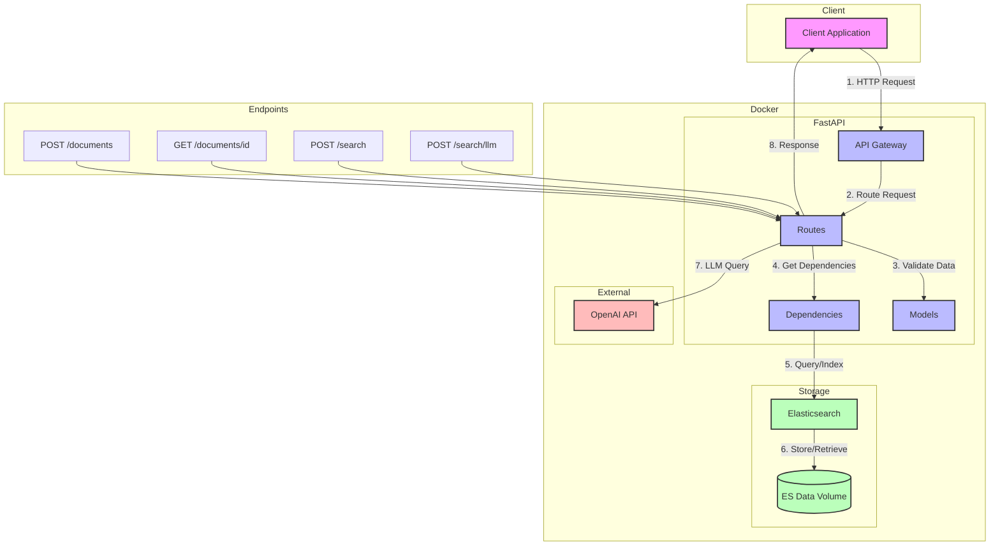
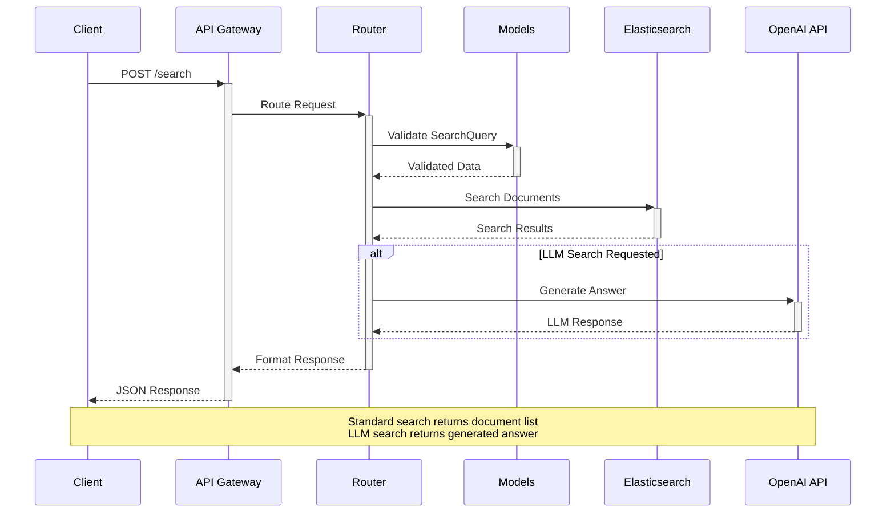
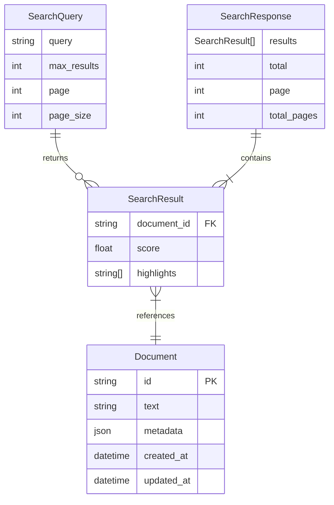

# Document Search Service

A RESTful service for storing, retrieving, and searching natural language documents with optional LLM-powered answers.

## Architecture Overview

The service is built using:
- **FastAPI**: Modern, fast web framework for building APIs
- **Elasticsearch**: Powerful search engine for document storage and retrieval
- **OpenAI GPT-3.5**: LLM for generating natural language answers
- **Docker**: Containerization for easy deployment
- **Pytest**: Comprehensive testing framework

## System Architecture

### Overview



### Components

The system architecture consists of a Client Application that interacts with a Docker environment containing FastAPI services, Elasticsearch storage, and integration with the OpenAI API.

### Data Flow

Requests flow from the Client through the API Gateway, are processed by Routes and Models, interact with Storage as needed, and responses are returned to the Client. LLM queries are sent to OpenAI when advanced processing is required.

### API Endpoints

The system provides endpoints for document management and search functionality through standard REST interfaces at /documents and /search paths.

## Request Flow


## Data Model


## API Endpoints

### Document Management
- `POST /api/v1/documents`
  - Create a new document
  - Request body: `{"text": "Document content"}`
  - Returns: Document ID and content

- `GET /api/v1/documents/{document_id}`
  - Retrieve a specific document
  - Returns: Document content and metadata

### Search
- `POST /api/v1/search`
  - Search documents
  - Request body: `{"query": "search terms", "max_results": 10}`
  - Returns: List of matching documents with relevance scores

- `POST /api/v1/search/llm`
  - Search with LLM-generated answers
  - Request body: `{"query": "your question"}`
  - Returns: AI-generated answer based on relevant documents

## Setup Instructions

1. **Prerequisites**
   - Docker and Docker Compose
   - OpenAI API key

2. **Installation**
   ```bash
   # Clone the repository
   git clone <repository-url>
   cd document-search

   # Create .env file
   cat > .env << EOL
   OPENAI_API_KEY=your-api-key-here
   ELASTICSEARCH_HOST=elasticsearch
   ELASTICSEARCH_PORT=9200
   MAX_SEARCH_RESULTS=10
   EOL

   # Build 
   docker-compose build --no-cache

   # Start the services
   docker-compose up -d
   ```

3. **Verification**
   - API will be available at `http://localhost:8000`
   - OpenAPI documentation at `http://localhost:8000/docs`
   - Elasticsearch at `http://localhost:9200`

## API Usage Examples

### Store a Document
```bash
curl -X POST "http://localhost:8000/api/v1/documents" \
     -H "Content-Type: application/json" \
     -d '{"text": "This is a sample document"}'
```

Response:
```json
{
    "document_id": "abc123",
    "text": "This is a sample document",
    "created_at": "2025-02-17T10:00:00Z"
}
```

### Search Documents
```bash
curl -X POST "http://localhost:8000/api/v1/search" \
     -H "Content-Type: application/json" \
     -d '{"query": "sample", "max_results": 5}'
```

Response:
```json
{
    "results": [
        {
            "document_id": "abc123",
            "text": "This is a sample document",
            "score": 0.8567
        }
    ],
    "total": 1,
    "page": 1,
    "total_pages": 1
}
```

### Get LLM-Generated Answer
```bash
curl -X POST "http://localhost:8000/api/v1/search/llm" \
     -H "Content-Type: application/json" \
     -d '{"query": "What is this document about?"}'
```

Response:
```json
{
    "answer": "The document is a sample text that demonstrates the document storage and retrieval system."
}
```

## Testing

### Run Tests
```bash
# Run all tests
docker-compose run test
```

### Test Coverage
- API endpoint tests
- Document creation and retrieval
- Search functionality
- LLM-powered search
- Error handling
- Edge cases

## Project Structure
```
document_search/
├── app/
│   ├── __init__.py
│   ├── main.py
│   ├── config.py
│   ├── dependencies.py
│   └── api/
│       ├── __init__.py
│       ├── models.py
│       └── routes.py
├── tests/
│   ├── __init__.py
│   ├── test_routes.py
│   └── conftest.py
├── docker-compose.yml
├── Dockerfile
├── README.md
└── requirements.txt
```

## Contributing

1. Fork the repository
2. Create your feature branch
3. Commit your changes
4. Push to the branch
5. Create a Pull Request